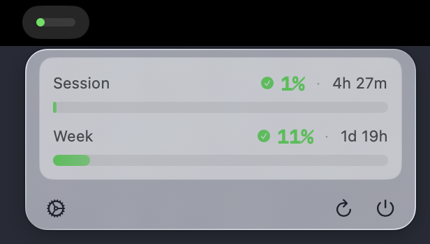

# cliMeter

macOS menu bar app that tracks Claude Code and OpenAI Codex usage in real time.

See session and weekly limits at a glance. Know when you're running low before you hit a wall.

[](https://github.com/bezlant/cliMeter/releases/latest)
[](https://github.com/bezlant/cliMeter/releases)


[](LICENSE)



## Why

Claude Code and Codex do not keep their usage limits visible while you work. You often find out when you're blocked. cliMeter fixes that with a tiny menu bar view that stays out of your way.

## Features

- **Menu bar progress bar** — color-coded (green/orange/red) so you know at a glance
- **Session + weekly tracking** — see both the 5-hour session and 7-day usage windows
- **Claude multi-account support** — manage multiple Claude accounts, switch between them
- **Claude auto-switch** — when one Claude account hits 95% utilization, automatically activates the next
- **Codex usage tracking** — shows OpenAI Codex session and weekly plan-limit windows
- **CLI sync** — picks up Claude Code `/login` credentials and Codex CLI login state
- **Per-provider toggles** — show or hide Claude and Codex independently
- **File-based credential storage** — optional alternative to macOS Keychain, reduces security prompts
- **Auto-update check** — notifies you when a new version is available

## Install

### Homebrew (recommended)

```bash
brew install bezlant/tap/climeter
```

### Manual download

Download `Climeter.zip` from [the latest release](https://github.com/bezlant/cliMeter/releases/latest), unzip, and drag `Climeter.app` to `/Applications`.

> **Note:** The app is not notarized. On first launch, right-click → Open, or go to System Settings → Privacy & Security → Open Anyway.

### Build from source

```bash
git clone git@github.com:bezlant/cliMeter.git
cd cliMeter
xcodebuild -scheme Climeter -configuration Release -derivedDataPath build
cp -R build/Build/Products/Release/Climeter.app /Applications/
```

## Update

```bash
brew upgrade climeter
```

New versions are published automatically — the Homebrew cask updates on every release.

## Setup

1. Open cliMeter — it appears in your menu bar
2. For Claude usage, run `/login` in Claude Code
3. For Codex usage, run `codex login`
4. cliMeter detects the credentials automatically

That's it. No API keys to paste, no config files to edit.

## Security

- Claude credentials are stored in macOS Keychain by default, with optional file-based storage
- Codex credentials are read from the Codex CLI auth file managed by `codex login`
- OAuth tokens with automatic refresh
- No data leaves your machine except provider API calls to Anthropic and OpenAI/ChatGPT usage endpoints
- No analytics, no telemetry, no tracking
- Open source — read every line

## How it works

cliMeter reads the OAuth credentials that Claude Code stores in the system Keychain (or its credentials file) for Claude usage. For Codex usage, it reads the current Codex CLI OAuth login from `$CODEX_HOME/auth.json` or `~/.codex/auth.json`. It polls provider usage endpoints every 3 minutes and displays the result. When tokens expire, it refreshes them silently.

You can toggle each provider on or off in Settings. File-based credential storage can be enabled to avoid Keychain security prompts — credentials are stored in `~/Library/Application Support/Climeter/credentials.json` instead.

Claude auto-switch applies only to Claude profiles. Codex usage is displayed separately and does not participate in account switching.

## Requirements

- macOS 14 (Sonoma) or later
- Claude Code CLI with an active Claude Pro/Team/Enterprise subscription for Claude usage
- Codex CLI with a ChatGPT/Codex plan for Codex usage

## License

MIT
